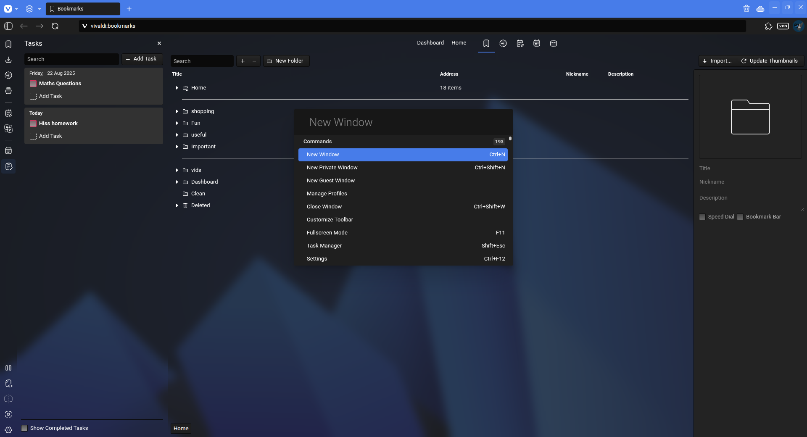
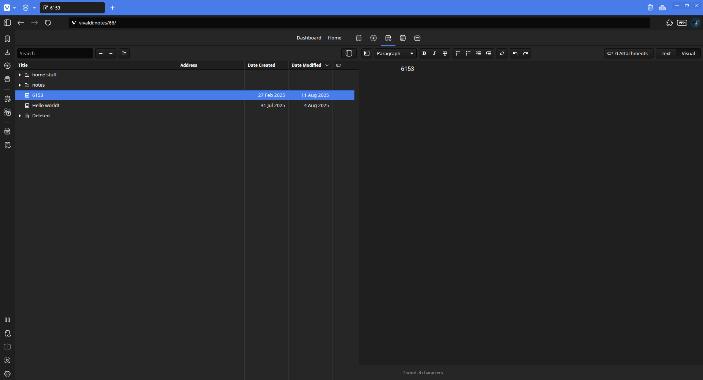
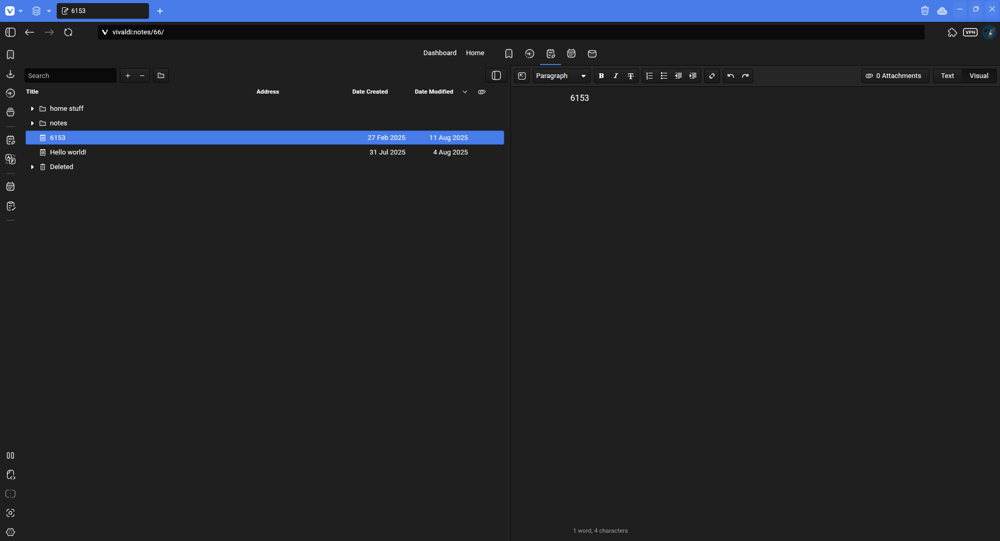
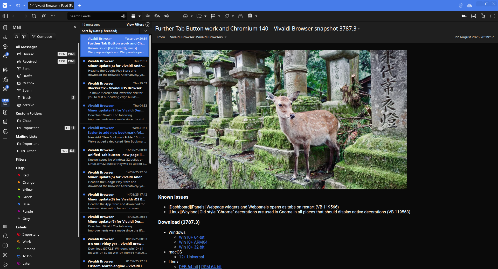
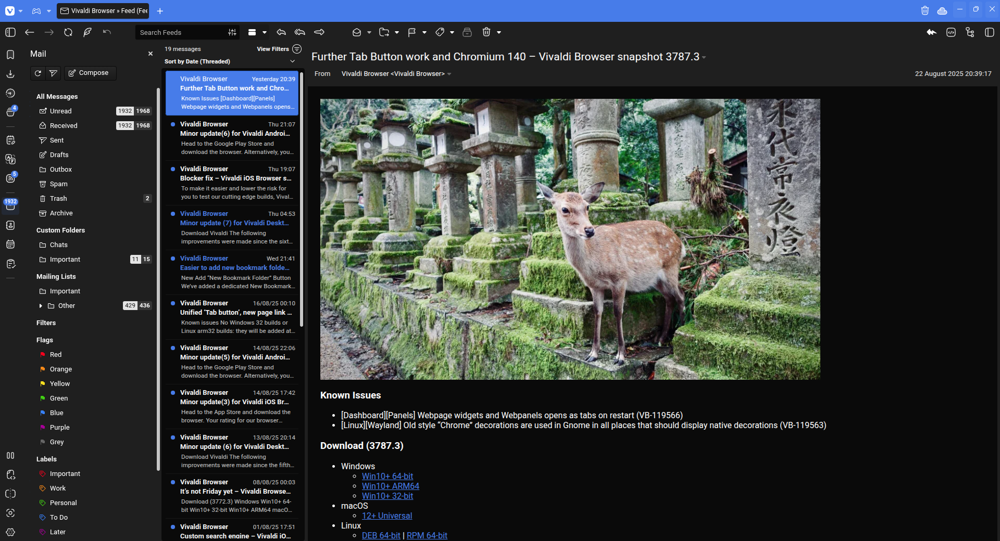

# Another-Vivaldi-css-theme
A css mod that makes Vivaldi look somewhat more cleaner!

> Themed use : [Link here](https://themes.vivaldi.net/themes/ZpY735a6vmz)

 
 

**New Transparency support!** (beta)

## Info about the mod
It removes and adds small changes that makes Vivaldi (in my opinion) look much better! While keeping the Vivaldi look.

It also adds some smaller stuff like:
- Rounds some Ui stuff depending on the theme
- Animations hovering effects
- BETTER TRANSPARENCY SUPPORT!
- Linux titlebar buttons

> [!note]
> This mod *should* be compatible with any theme but some things may look out of place depending on the theme.

> [!WARNING]
> May have some visual bugs and may break with updates!

## How to install

1. Clone this repo 

2. Go to Vivaldi and enter in the search bar: `vivaldi:experiments`

3. There should be an option called: "Allow CSS modification", enable it.

4. Restart Vivaldi.

5. Once done, in your search bar, go to `vivaldi:settings/appearance/`

6. Then scroll down and you should see an option called "CUSTOM UI MODIFICATION"

7. Click on "Select Folder" and pick the `Another-Vivaldi-css-theme` in your Download folder.

8. Restart and it should work!

> [!note]
> If you don't like the custom font, you can just delete the file named `custom_font`, or you can edit it!

## Some screenshots

**Without** the mod

**With** the mod

##  

**Without** the mod

**With** the mod

##  

**Without** the mod

**With** the mod

